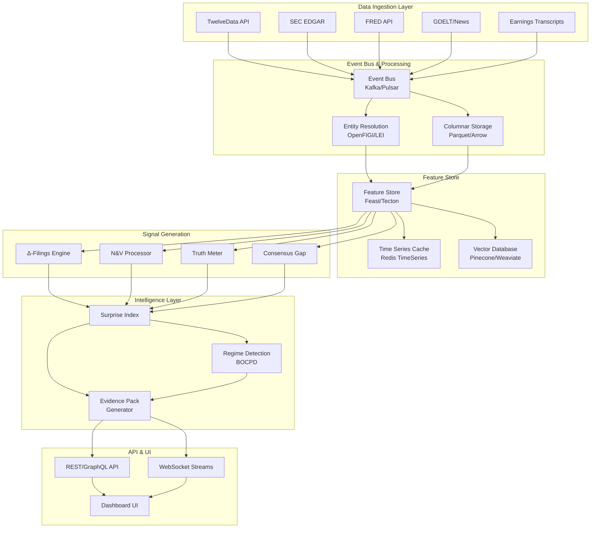
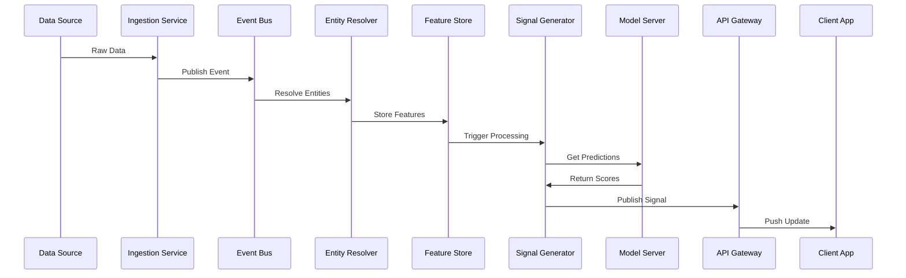

# RIVL System Architecture

## Overview
RIVL's architecture is designed for real-time information processing, belief-revision signal generation, and evidence-backed investment intelligence. The system prioritizes low latency, high reliability, and complete audit trails for every signal generated.

## High-Level Architecture



## Component Details

### 1. Data Ingestion Layer

#### Multi-Source Ingestion Pipeline
```python
class IngestionOrchestrator:
    def __init__(self):
        self.sources = {
            "twelvedata": TwelveDataConnector(),
            "edgar": EDGARConnector(),
            "fred": FREDConnector(),
            "gdelt": GDELTConnector(),
            "transcripts": TranscriptConnector()
        }
        self.event_bus = EventBusClient()
        
    async def ingest_all(self):
        tasks = []
        for source_name, connector in self.sources.items():
            task = asyncio.create_task(
                self.ingest_source(source_name, connector)
            )
            tasks.append(task)
        
        await asyncio.gather(*tasks)
    
    async def ingest_source(self, source_name, connector):
        async for data in connector.stream():
            event = self.create_event(source_name, data)
            await self.event_bus.publish(event)
```

#### Latency Requirements
- **Market Data**: < 100ms from source
- **News**: < 500ms from publication
- **Filings**: < 2s from EDGAR posting
- **Transcripts**: < 5s from release

### 2. Event Bus Architecture

#### Technology Choice
```yaml
Primary: Apache Kafka
- Throughput: 1M+ events/second
- Retention: 7 days standard, 90 days for compliance
- Partitioning: By ticker symbol for ordering

Alternative: Apache Pulsar
- Multi-tenancy support
- Geo-replication native
- Tiered storage built-in
```

#### Event Schema
```protobuf
message MarketEvent {
    string event_id = 1;
    string ticker = 2;
    int64 timestamp = 3;
    EventType type = 4;
    
    oneof payload {
        PriceUpdate price = 5;
        Filing filing = 6;
        NewsArticle news = 7;
        EarningsCall earnings = 8;
        MacroIndicator macro = 9;
    }
    
    map<string, string> metadata = 10;
    repeated string entity_ids = 11;  // OpenFIGI, LEI, CUSIP
}
```

### 3. Columnar Storage

#### Storage Architecture
```python
class ColumnarStorageManager:
    def __init__(self):
        self.parquet_writer = ParquetWriter()
        self.time_partitioner = TimePartitioner(grain="hourly")
        self.compactor = CompactionService()
        
    def store_events(self, events):
        # Partition by time and ticker
        partitioned = self.time_partitioner.partition(events)
        
        for partition_key, partition_events in partitioned.items():
            # Convert to columnar format
            df = self.events_to_dataframe(partition_events)
            
            # Write as Parquet with compression
            path = self.get_partition_path(partition_key)
            self.parquet_writer.write(
                df, 
                path,
                compression='snappy',
                row_group_size=100000
            )
        
        # Schedule compaction for older partitions
        self.compactor.schedule_compaction(partitioned.keys())
```

#### Schema Evolution
```sql
-- Version tracking for schema changes
CREATE TABLE schema_versions (
    version_id INT PRIMARY KEY,
    schema_name VARCHAR(100),
    version_number VARCHAR(20),
    migration_script TEXT,
    applied_at TIMESTAMP,
    backwards_compatible BOOLEAN
);
```

### 4. Entity Resolution Service

#### Multi-Identifier Mapping
```python
class EntityResolver:
    def __init__(self):
        self.figi_client = OpenFIGIClient()
        self.lei_client = GLEIFClient()
        self.mapping_cache = Redis()
        
    async def resolve(self, identifier, id_type="ticker"):
        # Check cache first
        cache_key = f"{id_type}:{identifier}"
        cached = await self.mapping_cache.get(cache_key)
        if cached:
            return json.loads(cached)
        
        # Resolve through appropriate service
        resolution = {}
        
        if id_type == "ticker":
            figi = await self.figi_client.ticker_to_figi(identifier)
            resolution["figi"] = figi
            resolution["lei"] = await self.get_lei_from_figi(figi)
            
        elif id_type == "cusip":
            figi = await self.figi_client.cusip_to_figi(identifier)
            resolution["figi"] = figi
            
        # Get all related identifiers
        resolution["all_identifiers"] = await self.get_all_identifiers(resolution["figi"])
        
        # Cache for 24 hours
        await self.mapping_cache.set(
            cache_key, 
            json.dumps(resolution),
            ex=86400
        )
        
        return resolution
```

### 5. Feature Store

#### Feature Engineering Pipeline
```python
class FeatureStore:
    def __init__(self):
        self.feast_client = feast.Client()
        self.feature_definitions = self.load_feature_definitions()
        
    def compute_features(self, entity, timestamp):
        features = {}
        
        # Point-in-time correct features
        features["price_features"] = self.feast_client.get_online_features(
            entity_ids=[entity],
            feature_ids=["price_sma_20", "price_std_20", "volume_ratio"],
            timestamp=timestamp
        )
        
        # Custom computed features
        features["filing_features"] = self.compute_filing_features(entity, timestamp)
        features["news_features"] = self.compute_news_features(entity, timestamp)
        features["macro_features"] = self.compute_macro_features(timestamp)
        
        return features
    
    def compute_filing_features(self, entity, timestamp):
        recent_filings = self.get_recent_filings(entity, timestamp, days=90)
        
        return {
            "filing_frequency": len(recent_filings),
            "risk_factor_changes": self.calculate_risk_changes(recent_filings),
            "sentiment_trend": self.calculate_sentiment_trend(recent_filings)
        }
```

### 6. Signal Generation Services

#### Parallel Signal Processing
```python
class SignalOrchestrator:
    def __init__(self):
        self.processors = {
            "delta_filings": DeltaFilingsProcessor(),
            "novelty_velocity": NoveltyVelocityProcessor(),
            "truth_meter": TruthMeterProcessor(),
            "consensus_gap": ConsensusGapProcessor()
        }
        
    async def generate_signals(self, event):
        # Parallel signal generation
        tasks = []
        for signal_type, processor in self.processors.items():
            if processor.can_process(event):
                task = asyncio.create_task(
                    processor.process(event)
                )
                tasks.append((signal_type, task))
        
        # Collect results
        signals = {}
        for signal_type, task in tasks:
            try:
                result = await asyncio.wait_for(task, timeout=5.0)
                signals[signal_type] = result
            except asyncio.TimeoutError:
                logging.error(f"Signal {signal_type} timed out")
                signals[signal_type] = None
        
        return signals
```

### 7. Model Layer

#### Model Serving Infrastructure
```python
class ModelServer:
    def __init__(self):
        self.models = {
            "surprise_index": self.load_model("surprise_index_v2"),
            "regime_detection": self.load_model("bocpd_regime_v1"),
            "gap_prediction": self.load_model("gap_closure_v3")
        }
        self.feature_cache = FeatureCache()
        
    async def predict(self, model_name, features):
        model = self.models.get(model_name)
        if not model:
            raise ValueError(f"Model {model_name} not found")
        
        # Feature preprocessing
        processed_features = await self.preprocess_features(model_name, features)
        
        # Batch prediction for efficiency
        if self.should_batch(model_name):
            return await self.batch_predict(model, processed_features)
        else:
            return model.predict(processed_features)
    
    async def batch_predict(self, model, features, max_batch_size=32):
        # Accumulate requests for batching
        batch = await self.accumulate_batch(features, max_batch_size)
        
        # Single model inference
        predictions = model.predict_batch(batch)
        
        # Distribute results
        return self.distribute_predictions(predictions)
```

### 8. API Layer

#### REST API Design
```python
from fastapi import FastAPI, WebSocket
from typing import List, Optional

app = FastAPI(title="RIVL API", version="1.0.0")

@app.get("/api/v1/signals/{ticker}")
async def get_signals(
    ticker: str,
    signal_types: Optional[List[str]] = None,
    start_time: Optional[datetime] = None,
    end_time: Optional[datetime] = None
):
    """Get signals for a specific ticker with evidence links"""
    signals = await signal_service.get_signals(
        ticker, signal_types, start_time, end_time
    )
    
    return {
        "ticker": ticker,
        "signals": signals,
        "evidence_pack": await evidence_service.generate_pack(ticker, signals),
        "generated_at": datetime.utcnow()
    }

@app.websocket("/ws/signals")
async def signal_stream(websocket: WebSocket):
    """Real-time signal streaming"""
    await websocket.accept()
    
    async for signal in signal_generator.stream():
        await websocket.send_json({
            "type": "signal",
            "data": signal.dict(),
            "timestamp": signal.timestamp.isoformat()
        })
```

#### GraphQL Schema
```graphql
type Query {
    ticker(symbol: String!): Ticker
    signals(
        tickers: [String!]
        types: [SignalType!]
        minScore: Float
        timeRange: TimeRange
    ): [Signal!]!
    evidencePack(ticker: String!, asOf: DateTime): EvidencePack
}

type Ticker {
    symbol: String!
    signals: [Signal!]!
    surpriseIndex: Float!
    regimeProbabilities: RegimeProbabilities!
    consensusGap: ConsensusGap
}

type Signal {
    type: SignalType!
    score: Float!
    confidence: Float!
    evidence: [Evidence!]!
    generatedAt: DateTime!
}

type Subscription {
    signalUpdates(tickers: [String!]!): Signal!
    regimeChanges: RegimeChange!
}
```

## Data Flow Architecture



## Scalability Considerations

### Horizontal Scaling
```yaml
components:
  ingestion:
    min_replicas: 2
    max_replicas: 10
    scale_metric: cpu_utilization
    target_value: 70
    
  signal_processing:
    min_replicas: 3
    max_replicas: 20
    scale_metric: queue_depth
    target_value: 1000
    
  api_gateway:
    min_replicas: 3
    max_replicas: 15
    scale_metric: request_rate
    target_value: 1000
```

### Caching Strategy
```python
CACHE_CONFIG = {
    "entity_resolution": {
        "ttl": 86400,  # 24 hours
        "max_size": "10GB"
    },
    "feature_store": {
        "ttl": 3600,  # 1 hour
        "max_size": "50GB",
        "eviction": "LRU"
    },
    "signal_cache": {
        "ttl": 300,  # 5 minutes
        "max_size": "5GB"
    },
    "model_predictions": {
        "ttl": 60,  # 1 minute
        "max_size": "2GB"
    }
}
```

## Monitoring & Observability

### Key Metrics
```python
METRICS = {
    "ingestion_latency": Histogram(
        "ingestion_latency_seconds",
        "Time to ingest and process raw data",
        buckets=[0.01, 0.05, 0.1, 0.5, 1.0, 5.0]
    ),
    "signal_generation_time": Histogram(
        "signal_generation_seconds",
        "Time to generate signals",
        buckets=[0.1, 0.5, 1.0, 2.0, 5.0, 10.0]
    ),
    "evidence_completeness": Gauge(
        "evidence_completeness_ratio",
        "Percentage of signals with complete evidence"
    ),
    "api_response_time": Histogram(
        "api_response_seconds",
        "API response time",
        buckets=[0.01, 0.05, 0.1, 0.25, 0.5, 1.0]
    )
}
```

### Distributed Tracing
```python
from opentelemetry import trace

tracer = trace.get_tracer(__name__)

@tracer.start_as_current_span("generate_signal")
async def generate_signal(event):
    span = trace.get_current_span()
    span.set_attribute("event.type", event.type)
    span.set_attribute("ticker", event.ticker)
    
    with tracer.start_as_current_span("fetch_features"):
        features = await fetch_features(event)
    
    with tracer.start_as_current_span("run_model"):
        prediction = await model.predict(features)
    
    with tracer.start_as_current_span("generate_evidence"):
        evidence = await generate_evidence(prediction)
    
    return Signal(prediction, evidence)
```

## Failure Handling

### Circuit Breaker Pattern
```python
class CircuitBreaker:
    def __init__(self, failure_threshold=5, timeout=60):
        self.failure_threshold = failure_threshold
        self.timeout = timeout
        self.failures = 0
        self.last_failure = None
        self.state = "closed"  # closed, open, half_open
        
    async def call(self, func, *args, **kwargs):
        if self.state == "open":
            if time.time() - self.last_failure > self.timeout:
                self.state = "half_open"
            else:
                raise CircuitOpenError()
        
        try:
            result = await func(*args, **kwargs)
            if self.state == "half_open":
                self.state = "closed"
                self.failures = 0
            return result
            
        except Exception as e:
            self.failures += 1
            self.last_failure = time.time()
            
            if self.failures >= self.failure_threshold:
                self.state = "open"
            
            raise e
```

### Graceful Degradation
```python
async def get_signals_with_fallback(ticker):
    try:
        # Try primary signal generation
        return await primary_signal_service.get_signals(ticker)
    except ServiceUnavailable:
        try:
            # Fall back to cached signals
            return await cache_service.get_cached_signals(ticker)
        except CacheM    try:
            # Last resort: basic signals only
            return await generate_basic_signals(ticker)
```

## Security Considerations

### API Authentication
```python
from fastapi.security import HTTPBearer, HTTPAuthorizationCredentials

security = HTTPBearer()

@app.get("/api/v1/signals/{ticker}")
async def get_signals(
    ticker: str,
    credentials: HTTPAuthorizationCredentials = Depends(security)
):
    # Validate JWT token
    user = await validate_token(credentials.credentials)
    
    # Check rate limits
    await rate_limiter.check(user.id)
    
    # Audit log
    await audit_logger.log(user.id, "get_signals", ticker)
    
    return await signal_service.get_signals(ticker, user.subscription_tier)
```

### Data Encryption
```yaml
encryption:
  at_rest:
    algorithm: AES-256-GCM
    key_management: AWS_KMS
    
  in_transit:
    internal: TLS_1.3
    external: TLS_1.3_with_mTLS
    
  sensitive_fields:
    - user_credentials
    - api_keys
    - trading_signals
```

## TODO Items
- `TODO(infrastructure, 2025-01-25)`: Implement Kubernetes deployment configs
- `TODO(platform, 2025-01-28)`: Set up distributed tracing with Jaeger
- `TODO(security, 2025-02-01)`: Implement mTLS for service communication
- `TODO(data-eng, 2025-02-04)`: Design data retention and archival strategy