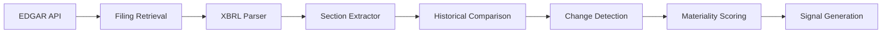

# Δ-Filings Redline Signal

## Overview
The Δ-Filings Redline signal detects material changes in SEC filings (10-K/Q) by performing semantic diffs on critical sections, particularly Risk Factors and Management Discussion & Analysis (MD&A). This signal identifies when companies alter their forward-looking statements, risk disclosures, or business outlook in ways that may precede market consensus shifts.

## Mathematical Foundation

### Core Formula
```
ΔF_score = Σ(token_change × materiality_weight × section_importance)
```

Where:
- `token_change`: Normalized edit distance at token level
- `materiality_weight`: Domain-specific weight for financial terms
- `section_importance`: Weight based on filing section (Risk Factors = 1.0, MD&A = 0.9, etc.)

### Detailed Calculation

#### 1. Token-Level Change Detection
```python
def calculate_token_change(old_text, new_text):
    old_tokens = tokenize(old_text)
    new_tokens = tokenize(new_text)
    
    # Levenshtein distance normalized by length
    distance = levenshtein(old_tokens, new_tokens)
    max_length = max(len(old_tokens), len(new_tokens))
    
    return distance / max_length if max_length > 0 else 0
```

#### 2. Materiality Weighting
```python
MATERIAL_TERMS = {
    "bankruptcy": 3.0,
    "litigation": 2.5,
    "regulatory": 2.5,
    "material weakness": 3.0,
    "going concern": 3.0,
    "restatement": 2.8,
    "impairment": 2.3,
    "default": 2.7,
    "covenant": 2.2,
    "discontinue": 2.4
}

def calculate_materiality(text_segment):
    weight = 1.0  # base weight
    for term, term_weight in MATERIAL_TERMS.items():
        if term in text_segment.lower():
            weight = max(weight, term_weight)
    return weight
```

#### 3. Section Importance
```python
SECTION_WEIGHTS = {
    "risk_factors": 1.0,
    "mda": 0.9,
    "business": 0.7,
    "legal_proceedings": 0.8,
    "financial_statements": 0.6,
    "controls_procedures": 0.8
}
```

## Input Data Sources

### Primary Sources
1. **SEC EDGAR API**
   - Real-time filing retrieval
   - XBRL structured data
   - Historical filing archive

2. **Filing Types Monitored**
   - 10-K (annual reports)
   - 10-Q (quarterly reports)
   - 8-K (current reports)
   - DEF 14A (proxy statements)
   - S-1 (registration statements)

### Data Pipeline


## Output Specifications

### Signal Range
- **Score**: 0.0 to 1.0 (normalized)
- **Direction**: -1 (negative change), 0 (neutral), +1 (positive change)
- **Confidence**: 0.0 to 1.0 based on data completeness

### Signal Object
```json
{
  "signal_type": "delta_filings",
  "ticker": "AAPL",
  "score": 0.73,
  "direction": -1,
  "confidence": 0.92,
  "changes": [
    {
      "section": "risk_factors",
      "change_type": "addition",
      "materiality": 2.5,
      "snippet": "New regulatory requirements in the EU may materially impact...",
      "location": "Item 1A, Paragraph 7"
    }
  ],
  "filing_comparison": {
    "current": "0001628280-24-123456",
    "previous": "0001628280-23-123456",
    "days_between": 91
  },
  "generated_at": "2025-01-15T10:30:00Z"
}
```

## Example Implementation

### Real-World Example: Tech Company Risk Update
**Scenario**: A technology company updates its 10-Q risk factors

**Previous Filing (Q2 2024)**:
> "We face competition from established players in the cloud computing market."

**Current Filing (Q3 2024)**:
> "We face intense competition from established players in the cloud computing market, and new entrants with significant resources have begun aggressively targeting our core customer base, which may materially impact our market share and pricing power."

**Signal Calculation**:
1. Token change: 0.68 (significant expansion)
2. Materiality weight: 2.3 ("materially impact" trigger)
3. Section importance: 1.0 (risk factors)
4. **Final score**: 0.68 × 2.3 × 1.0 = **0.78** (High alert)

## Limitations and Caveats

### Known Limitations
1. **Boilerplate Changes**: Some filing changes are legally required and non-material
2. **Seasonal Patterns**: Certain sections naturally change with business cycles
3. **Industry Variations**: Different sectors have different material term relevance
4. **Filing Delays**: EDGAR submissions can be delayed up to 4 business days

### Mitigation Strategies
- Filter out standard legal language updates
- Maintain industry-specific materiality dictionaries
- Cross-reference with peer company filings
- Implement time-decay for older comparisons

## Integration Points

### Downstream Consumers
- **Surprise Index Model**: Primary input for belief revision
- **Evidence Pack Generator**: Source documentation links
- **Risk Dashboard**: Real-time alerting system

### Upstream Dependencies
- **Entity Resolution Service**: Ticker to CIK mapping
- **Filing Storage Service**: Historical filing cache
- **NLP Service**: Advanced semantic analysis

## Performance Metrics

### Quality Metrics
- **Precision**: Percentage of detected changes that are material
- **Recall**: Percentage of material changes detected
- **F1 Score**: Harmonic mean of precision and recall

### Operational Metrics
- **Processing Time**: <2 seconds per filing
- **Storage Required**: ~500KB per filing comparison
- **API Rate Limits**: 10 requests/second to EDGAR

## Configuration

### Environment Variables
```yaml
EDGAR_API_KEY: ${EDGAR_API_KEY}
FILING_CACHE_DIR: /data/filings
MATERIALITY_THRESHOLD: 0.3
MAX_FILING_AGE_DAYS: 365
PARALLEL_WORKERS: 4
```

### Tunable Parameters
```python
CONFIG = {
    "min_change_threshold": 0.1,  # Minimum change to trigger signal
    "lookback_periods": 4,         # Number of previous filings to compare
    "semantic_similarity_model": "sentence-transformers/all-MiniLM-L6-v2",
    "batch_size": 50,              # Filings to process in parallel
    "cache_ttl_hours": 24          # Cache expiration
}
```

## TODO Items
- `TODO(nlp-team, 2025-01-25)`: Implement multilingual support for foreign filers
- `TODO(data-team, 2025-01-28)`: Add inline XBRL parsing for better structure
- `TODO(ml-team, 2025-02-01)`: Train custom materiality classifier
- `TODO(platform, 2025-02-05)`: Implement real-time EDGAR streaming