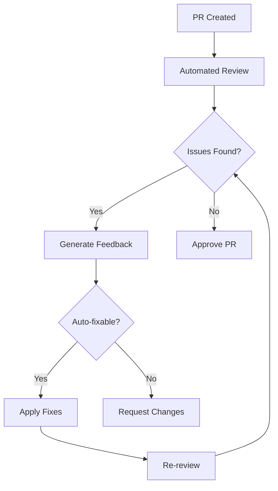

# Automated Review Systems

## Concept Overview
Implement comprehensive automated review systems that provide instant, multi-perspective feedback on code, documentation, and system design, eliminating manual review bottlenecks.

## Review Architecture

### Multi-Layer Review System
```
Code Submission
       ↓
┌──────────────────────────────┐
│   Parallel Review Agents     │
├──────────────────────────────┤
│ • Code Quality Agent         │
│ • Security Agent             │
│ • Performance Agent          │
│ • Documentation Agent        │
│ • Testing Agent              │
│ • Architecture Agent         │
└──────────────────────────────┘
       ↓
  Aggregated Feedback
       ↓
  Automated Fixes
       ↓
  Human Validation (Optional)
```

## Review Agent Specifications

### 1. Code Quality Agent
```python
class CodeQualityAgent:
    def review(self, code):
        checks = {
            'style': check_style_compliance(),
            'complexity': analyze_complexity(),
            'duplication': detect_duplication(),
            'patterns': verify_design_patterns(),
            'naming': check_naming_conventions(),
            'structure': analyze_code_structure()
        }
        return generate_feedback(checks)
    
    def auto_fix(self, issues):
        for issue in issues:
            if issue.auto_fixable:
                apply_fix(issue)
```

#### Review Criteria
- **Style Compliance**: 100% adherence
- **Complexity Score**: <10 cyclomatic complexity
- **Duplication**: <3% duplicate code
- **Pattern Usage**: Correct implementation
- **Naming**: Consistent and meaningful
- **Structure**: Logical organization

### 2. Security Review Agent
```python
class SecurityAgent:
    vulnerabilities = [
        'sql_injection',
        'xss',
        'csrf',
        'authentication_bypass',
        'data_exposure',
        'dependency_vulnerabilities'
    ]
    
    def scan(self, code):
        for vulnerability in self.vulnerabilities:
            check_vulnerability(code, vulnerability)
```

#### Security Checks
- Input validation
- Authentication mechanisms
- Authorization controls
- Data encryption
- Secret management
- Dependency scanning

### 3. Performance Review Agent
#### Analysis Areas
- Algorithm efficiency
- Database query optimization
- Memory usage patterns
- CPU utilization
- Network calls
- Caching opportunities

### 4. Documentation Review Agent
#### Documentation Requirements
- Function documentation: 100%
- Class documentation: 100%
- Module overview: Required
- Usage examples: Recommended
- API documentation: Automated
- README updates: Synchronized

### 5. Testing Review Agent
#### Test Coverage Requirements
- Line coverage: >85%
- Branch coverage: >80%
- Edge cases: Identified
- Integration tests: Required
- Performance tests: For critical paths
- Security tests: For sensitive operations

## Automated Feedback System

### Feedback Generation
```yaml
feedback_template:
  severity: [critical, high, medium, low, info]
  category: [security, performance, quality, documentation, testing]
  location: 
    file: path/to/file
    line: 123
    column: 45
  issue: "Detailed description"
  suggestion: "How to fix"
  auto_fix_available: true/false
  references: ["link to documentation"]
```

### Intelligent Prioritization
1. **Critical**: Security vulnerabilities, data loss risks
2. **High**: Performance issues, major bugs
3. **Medium**: Code quality, minor bugs
4. **Low**: Style issues, optimizations
5. **Info**: Suggestions, best practices

## Automated Fix System

### Auto-Fix Categories
```python
auto_fixable = {
    'formatting': True,
    'imports': True,
    'simple_refactoring': True,
    'documentation': True,
    'type_hints': True,
    'security_patches': Conditional,
    'performance': Conditional,
    'logic_errors': False
}
```

### Fix Application Process
1. Identify fixable issues
2. Generate fix proposals
3. Apply fixes in order
4. Validate fixes don't break tests
5. Commit with descriptive message

## Review Workflows

### Pull Request Workflow


### Continuous Review
- Real-time feedback during development
- Pre-commit hooks
- IDE integration
- Live suggestions

## Implementation Strategy

### Phase 1: Basic Automation
- Style checking
- Basic security scans
- Test coverage
- Documentation checks

### Phase 2: Intelligent Review
- AI-powered code review
- Pattern recognition
- Context-aware suggestions
- Learning from feedback

### Phase 3: Autonomous Fixing
- Automatic repair
- Refactoring suggestions
- Performance optimization
- Documentation generation

## Review Metrics

### Efficiency Metrics
| Metric | Manual | Automated | Improvement |
|--------|--------|-----------|-------------|
| Review Time | 2 hours | 2 minutes | 60x |
| Issues Found | 10-15 | 50-100 | 5x |
| Fix Time | 1 hour | 5 minutes | 12x |
| Consistency | 70% | 100% | Perfect |

### Quality Metrics
- **False Positive Rate**: <5%
- **Issue Detection Rate**: >95%
- **Auto-Fix Success**: >80%
- **Developer Satisfaction**: >90%

## Integration Points

### Development Tools
- **IDEs**: VS Code, IntelliJ, Sublime
- **Git Platforms**: GitHub, GitLab, Bitbucket
- **CI/CD**: Jenkins, GitHub Actions, CircleCI
- **Project Management**: JIRA, Linear, Asana

### Communication
- Slack notifications
- Email reports
- Dashboard displays
- PR comments

## Advanced Features

### 1. Learning System
```python
class LearningReviewSystem:
    def learn_from_feedback(self, human_feedback):
        # Update rules based on corrections
        # Improve detection accuracy
        # Reduce false positives
        # Add new patterns
```

### 2. Context-Aware Review
- Understand project conventions
- Respect team preferences
- Consider business logic
- Adapt to domain requirements

### 3. Predictive Analysis
- Anticipate future issues
- Suggest preventive measures
- Identify risk areas
- Recommend refactoring

## Configuration Management

### Project-Specific Rules
```yaml
review_config:
  code_quality:
    max_complexity: 10
    max_line_length: 100
    naming_convention: snake_case
  
  security:
    strict_mode: true
    scan_dependencies: true
    block_vulnerable: true
  
  performance:
    max_query_time: 100ms
    memory_limit: 512MB
    cpu_threshold: 80%
  
  documentation:
    require_examples: true
    api_docs: mandatory
    changelog: automated
```

### Team Preferences
- Review strictness levels
- Auto-fix permissions
- Notification preferences
- Escalation rules

## ROI Analysis

### Time Savings
- **Review Time**: 95% reduction
- **Bug Detection**: 3x improvement
- **Fix Time**: 80% reduction
- **Deployment Speed**: 5x faster

### Cost Benefits
- Reduced manual review hours
- Fewer production bugs
- Lower maintenance costs
- Faster time to market

## Best Practices

### Implementation
1. Start with basic checks
2. Gradually increase coverage
3. Tune for low false positives
4. Enable auto-fix incrementally
5. Monitor and adjust

### Adoption
1. Train team on system
2. Start with warnings only
3. Gradually enforce rules
4. Collect feedback
5. Continuously improve

## Future Enhancements

### AI-Powered Reviews
- Natural language feedback
- Code intention understanding
- Business logic validation
- Architectural decisions

### Collaborative Review
- Multiple AI agents discussion
- Consensus building
- Trade-off analysis
- Decision documentation

## Success Metrics

### Adoption
- 100% of PRs reviewed automatically
- 80% issues fixed automatically
- 90% developer acceptance
- 50% reduction in review cycle time

### Quality Impact
- 70% fewer bugs in production
- 90% consistent code style
- 100% security scan coverage
- 85% test coverage maintained