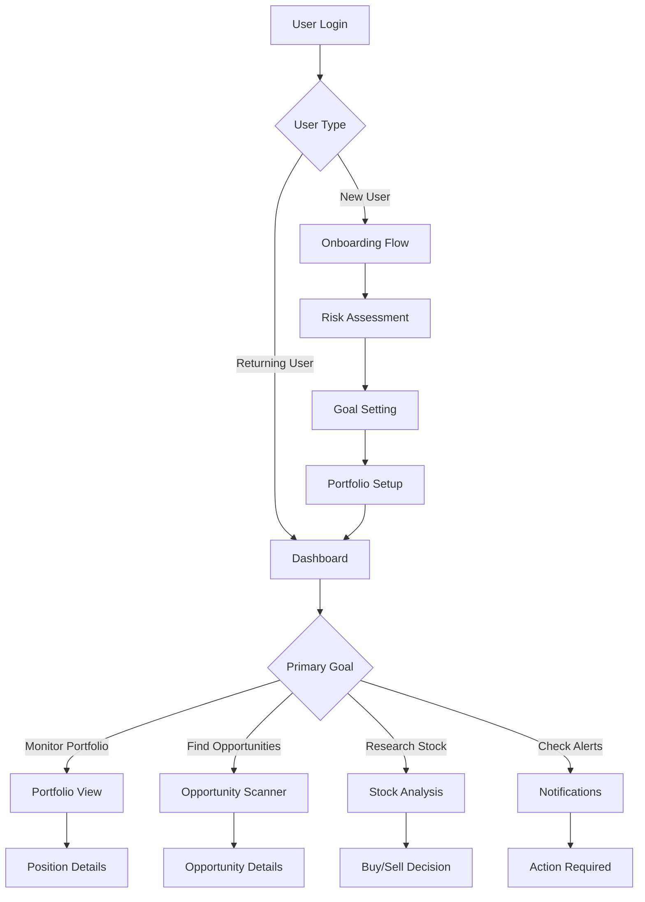

# 🎨 Presentation Layer - User Interface & Experience

**Purpose**: Create an intuitive, powerful interface that makes complex investment intelligence accessible to all users.

## 🎯 Overview

The Presentation Layer transforms sophisticated investment intelligence into an intuitive, actionable user experience through:
- Modern, responsive dashboard design
- Interactive data visualizations
- Real-time updates and notifications
- Customizable user interfaces
- Mobile-first responsive design

## 📁 Section Contents

| File | Description | Priority |
|------|-------------|----------|
| [dashboard-design.md](dashboard-design.md) | Main dashboard layout and components | CRITICAL |
| [visualization-components.md](visualization-components.md) | Charts, graphs, and data visualizations | HIGH |
| [user-experience.md](user-experience.md) | UX patterns and user flows | HIGH |
| [mobile-interface.md](mobile-interface.md) | Mobile app design and functionality | MEDIUM |
| [customization-system.md](customization-system.md) | User customization and personalization | MEDIUM |

## 🏗️ Presentation Architecture

```
┌─────────────────────────────────────────────────────────┐
│                    PRESENTATION LAYER                    │
│              "Intelligence Made Accessible"              │
└─────────────────┬───────────────────────────────────────┘
                  │
    ┌─────────────┼─────────────┐
    │             │             │
┌───┼────┐   ┌───┼────┐   ┌───┼────┐
│DASH │   │VIZ │   │UX  │
│BOARD│   │COMP│   │FLOW│
└────────┘   └────────┘   └────────┘
    │             │             │
    └─────────────┼─────────────┘
                  │
         ┌────────┼────────┐
         │                 │
    ┌───┼────┐      ┌───┼────┐
    │MOBILE│      │CUSTOM│
    │INTER │      │SYSTEM│
    └────────┘      └────────┘
         │                 │
         └────────┼────────┘
                  │
┌─────────────────┼─────────────────┐
│       RESPONSIVE DESIGN ENGINE     │
│     "Works beautifully everywhere" │
└────────────────────────────────────┘
```

## 🎪 Dashboard Philosophy

### Design Principles
```typescript
const DESIGN_PRINCIPLES = {
  clarity: {
    principle: 'Information First',
    implementation: 'Clean layouts, clear typography, logical hierarchy',
    goal: 'Users understand insights immediately'
  },
  efficiency: {
    principle: 'Minimize Cognitive Load',
    implementation: 'Smart defaults, progressive disclosure, contextual actions',
    goal: 'Users achieve goals with minimal effort'
  },
  intelligence: {
    principle: 'Predictive Interface',
    implementation: 'AI-suggested actions, smart notifications, adaptive layouts',
    goal: 'Interface anticipates user needs'
  },
  trust: {
    principle: 'Transparent Confidence',
    implementation: 'Confidence indicators, explanation tooltips, source attribution',
    goal: 'Users trust the intelligence provided'
  },
  personalization: {
    principle: 'Adaptive Experience',
    implementation: 'Customizable dashboards, user preference learning, role-based views',
    goal: 'Interface adapts to individual user patterns'
  }
}
```

## 📱 Responsive Design Strategy

### Device Optimization
```typescript
const DEVICE_STRATEGY = {
  desktop: {
    focus: 'Comprehensive analysis',
    layout: 'Multi-panel dashboard',
    interaction: 'Mouse + keyboard shortcuts',
    data_density: 'High - detailed charts and tables'
  },
  tablet: {
    focus: 'Portfolio monitoring',
    layout: 'Card-based responsive grid',
    interaction: 'Touch-optimized controls',
    data_density: 'Medium - essential metrics highlighted'
  },
  mobile: {
    focus: 'Quick insights and alerts',
    layout: 'Single-column stack',
    interaction: 'Swipe gestures and tap actions',
    data_density: 'Low - key metrics only'
  }
}
```

## 🎨 Visual Design System

### Color Psychology for Finance
```scss
// Investment-focused color palette
$colors: (
  // Performance colors
  'bull-green': #10b981,     // Strong positive performance
  'bear-red': #ef4444,       // Negative performance
  'neutral-gray': #6b7280,   // Neutral/sideways movement
  
  // Confidence levels
  'high-confidence': #059669, // High confidence recommendations
  'med-confidence': #d97706,  // Medium confidence
  'low-confidence': #dc2626,  // Low confidence warnings
  
  // Risk levels
  'low-risk': #10b981,       // Safe investments
  'med-risk': #f59e0b,       // Moderate risk
  'high-risk': #ef4444,      // High risk warnings
  
  // Intelligence indicators
  'ai-insight': #8b5cf6,     // AI-generated insights
  'human-insight': #06b6d4,  // Human analysis
  'data-source': #64748b     // Data attribution
);

// Semantic color system
$semantic-colors: (
  'success': var(--bull-green),
  'warning': var(--med-risk),
  'danger': var(--bear-red),
  'info': var(--ai-insight),
  'primary': var(--high-confidence)
);
```

### Typography System
```scss
// Investment-focused typography
$typography: (
  'display': (
    family: 'Inter, system-ui, sans-serif',
    weight: 700,
    purpose: 'Headlines and key metrics'
  ),
  'body': (
    family: 'Inter, system-ui, sans-serif',
    weight: 400,
    purpose: 'General content and explanations'
  ),
  'mono': (
    family: 'JetBrains Mono, Monaco, monospace',
    weight: 500,
    purpose: 'Stock symbols, prices, percentages'
  )
);
```

## 🔄 Real-Time Update System

### Live Data Strategy
```typescript
interface RealTimeSystem {
  // WebSocket connections for live data
  priceUpdates: {
    frequency: 'Every 5 seconds during market hours',
    scope: 'Watchlist and portfolio positions',
    fallback: 'HTTP polling every 30 seconds'
  };
  
  // Notification system
  intelligenceAlerts: {
    trigger: 'New insights, recommendations, or warnings',
    delivery: 'Push notifications + in-app alerts',
    priority: 'High = immediate, Medium = batched'
  };
  
  // Progressive enhancement
  offline: {
    strategy: 'Show last known data with timestamp',
    functionality: 'Limited to cached analysis',
    sync: 'Auto-sync when connection restored'
  };
}
```

## 🎯 User Experience Flows

### Core User Journeys


### Interaction Patterns
```typescript
const INTERACTION_PATTERNS = {
  // Progressive disclosure
  drill_down: {
    pattern: 'Summary → Details → Deep Analysis',
    implementation: 'Card expansion, modal overlays, dedicated pages',
    example: 'Stock card → Chart overlay → Full analysis page'
  },
  
  // Contextual actions
  hover_actions: {
    pattern: 'Hover reveals related actions',
    implementation: 'Floating action buttons, context menus',
    example: 'Hover stock → Add to watchlist, Buy, Analyze'
  },
  
  // Guided workflows
  smart_suggestions: {
    pattern: 'AI suggests next logical actions',
    implementation: 'Suggestion cards, smart notifications',
    example: 'After viewing analysis → "Would you like to set a price alert?"'
  }
}
```

## 📊 Data Visualization Standards

### Chart Types by Use Case
```typescript
const CHART_STANDARDS = {
  price_movements: {
    primary: 'Candlestick chart with volume',
    secondary: 'Line chart for trends',
    interactive: 'Zoom, pan, crosshairs, annotations'
  },
  
  performance_comparison: {
    primary: 'Normalized line chart',
    secondary: 'Bar chart for periods',
    interactive: 'Toggle series, date range selection'
  },
  
  portfolio_allocation: {
    primary: 'Treemap for large portfolios',
    secondary: 'Donut chart for small portfolios',
    interactive: 'Drill-down by sector/holding'
  },
  
  risk_analysis: {
    primary: 'Risk-return scatter plot',
    secondary: 'Risk gauge/meter',
    interactive: 'Scenario simulation sliders'
  }
}
```

## 🎮 Interaction Design

### Gesture Support
```typescript
const GESTURE_SUPPORT = {
  touch_devices: {
    'pinch_zoom': 'Chart zooming',
    'two_finger_pan': 'Chart panning',
    'swipe_left': 'Next stock in watchlist',
    'swipe_right': 'Previous stock in watchlist',
    'pull_to_refresh': 'Update data',
    'long_press': 'Context menu'
  },
  
  keyboard_shortcuts: {
    'ctrl+/': 'Show keyboard shortcuts',
    'g+d': 'Go to dashboard',
    'g+p': 'Go to portfolio',
    'g+w': 'Go to watchlist',
    's': 'Search stocks',
    'a': 'Add to watchlist',
    'esc': 'Close modals/overlays'
  }
}
```

## 🌙 Theme System

### Dark/Light Mode Strategy
```scss
// Adaptive theming
@mixin theme-colors($theme) {
  @if $theme == 'light' {
    --bg-primary: #ffffff;
    --bg-secondary: #f8fafc;
    --text-primary: #0f172a;
    --text-secondary: #475569;
    --border-color: #e2e8f0;
  } @else if $theme == 'dark' {
    --bg-primary: #0f172a;
    --bg-secondary: #1e293b;
    --text-primary: #f8fafc;
    --text-secondary: #cbd5e1;
    --border-color: #334155;
  }
}

// System preference detection
@media (prefers-color-scheme: dark) {
  :root {
    @include theme-colors('dark');
  }
}
```

## 🏆 Performance Standards

### Loading & Responsiveness
| Metric | Target | Measurement |
|--------|--------|-------------|
| Initial page load | <2 seconds | Time to interactive |
| Chart rendering | <500ms | Data to pixels |
| Search results | <300ms | Keystroke to results |
| Navigation | <100ms | Click to route change |
| Data refresh | <1 second | API call to UI update |

### Accessibility Standards
| Standard | Compliance | Implementation |
|----------|------------|----------------|
| WCAG 2.1 AA | Full compliance | Color contrast, keyboard nav, screen readers |
| Keyboard navigation | 100% functional | Tab order, focus indicators, shortcuts |
| Screen reader support | Optimized | ARIA labels, landmarks, live regions |
| Color accessibility | Colorblind friendly | Patterns + colors, sufficient contrast |

## 🚀 Implementation Phases

### Phase 1: Core Dashboard (2 weeks)
1. Main dashboard layout and navigation
2. Basic chart components
3. Portfolio overview cards
4. Real-time price updates

### Phase 2: Interactive Features (2 weeks)
1. Advanced chart interactions
2. Search and filtering
3. Notification system
4. Basic customization

### Phase 3: Intelligence Integration (2 weeks)
1. Recommendation displays
2. Risk visualization
3. Opportunity scanner UI
4. Explanation interface

### Phase 4: Mobile & Polish (1 week)
1. Mobile-responsive design
2. Performance optimization
3. Accessibility improvements
4. User testing and refinement

## 📈 Success Metrics

### User Engagement
| Metric | Target | Current |
|--------|--------|---------|
| Daily active users | >80% of registered | - |
| Session duration | >15 minutes | - |
| Feature adoption | >60% use core features | - |
| Mobile usage | >40% of sessions | - |
| User satisfaction | >8.5/10 rating | - |

### Performance Metrics
| Metric | Target | Current |
|--------|--------|---------|
| Page load speed | <2 seconds | - |
| Chart render time | <500ms | - |
| Search response | <300ms | - |
| Uptime | >99.5% | - |
| Error rate | <0.1% | - |

---

**Next Steps**:
1. Design comprehensive dashboard layout
2. Build reusable visualization components
3. Create intuitive user experience flows
4. Optimize for mobile devices
5. Implement customization system