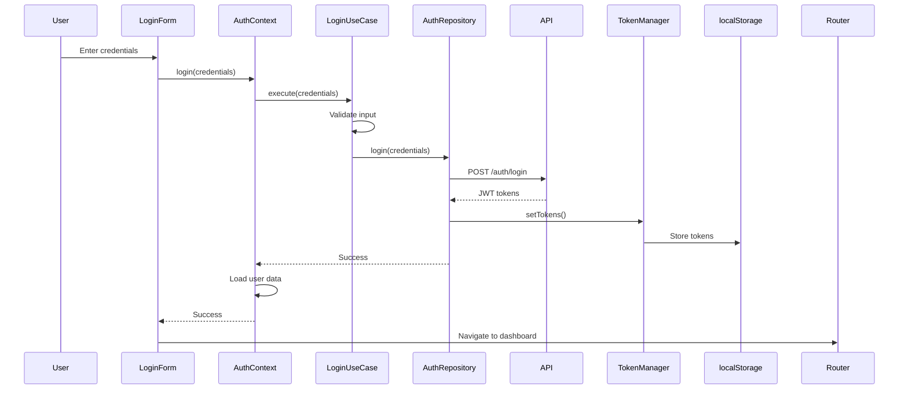
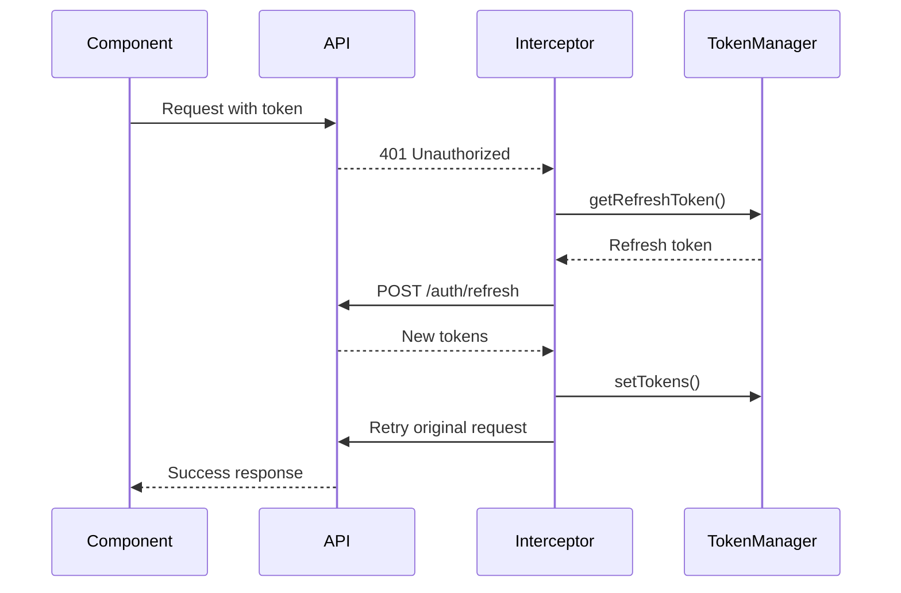

# Authentication System

## Overview

The authentication system provides secure user authentication with JWT tokens, automatic token refresh, Google OAuth integration, and protected routes. The system follows security best practices and integrates seamlessly with the backend API.

## Architecture

```
┌─────────────────────────────────────────┐
│         Login/Register Page             │
├─────────────────────────────────────────┤
│           AuthContext                   │
├─────────────────────────────────────────┤
│    LoginUseCase / GoogleAuthUseCase    │
├─────────────────────────────────────────┤
│         AuthRepository                  │
├─────────────────────────────────────────┤
│          TokenManager                   │
├─────────────────────────────────────────┤
│         API Client / HTTP               │
└─────────────────────────────────────────┘
```

## Core Components

### 1. Token Manager (`app/core/infrastructure/auth/TokenManager.ts`)

Singleton class managing JWT tokens in localStorage.

```typescript
export class TokenManager {
  private static instance: TokenManager;
  private readonly ACCESS_TOKEN_KEY = 'access_token';
  private readonly REFRESH_TOKEN_KEY = 'refresh_token';
  private readonly TOKEN_EXPIRY_KEY = 'token_expiry';

  setTokens(tokens: AuthTokens): void {
    localStorage.setItem(this.ACCESS_TOKEN_KEY, tokens.accessToken);
    if (tokens.refreshToken) {
      localStorage.setItem(this.REFRESH_TOKEN_KEY, tokens.refreshToken);
    }
    const expiryTime = Date.now() + (tokens.expiresIn * 1000);
    localStorage.setItem(this.TOKEN_EXPIRY_KEY, expiryTime.toString());
  }

  getAccessToken(): string | null {
    const token = localStorage.getItem(this.ACCESS_TOKEN_KEY);
    const expiry = localStorage.getItem(this.TOKEN_EXPIRY_KEY);

    if (token && expiry) {
      const expiryTime = parseInt(expiry, 10);
      if (Date.now() < expiryTime) {
        return token;
      } else {
        this.clearTokens(); // Token expired
      }
    }
    return null;
  }

  isAuthenticated(): boolean {
    return this.getAccessToken() !== null;
  }
}
```

### 2. Auth Repository (`app/core/infrastructure/repositories/AuthRepository.ts`)

Implements authentication operations with the backend.

```typescript
export class AuthRepository implements IAuthRepository {
  private apiClient: ApiClient;
  private tokenManager: TokenManager;

  async login(credentials: LoginCredentials): Promise<AuthTokens> {
    const response = await this.apiClient.getHttpClient().post<{
      access_token: string;
      refresh_token?: string;
      token_type: string;
      expires_in: number;
    }>('/api/v1/auth/login', credentials);

    const tokens: AuthTokens = {
      accessToken: response.data.access_token,
      refreshToken: response.data.refresh_token,
      expiresIn: response.data.expires_in || 3600
    };

    this.tokenManager.setTokens(tokens);
    return tokens;
  }

  async register(data: RegisterData): Promise<AuthTokens> {
    const response = await this.apiClient.getHttpClient().post<{
      access_token: string;
      refresh_token?: string;
    }>('/api/v1/auth/register', data);

    const tokens = this.parseTokenResponse(response.data);
    this.tokenManager.setTokens(tokens);
    return tokens;
  }

  async refreshToken(refreshToken: string): Promise<AuthTokens> {
    const response = await this.apiClient.getHttpClient().post(
      '/api/v1/auth/refresh',
      { refresh_token: refreshToken }
    );
    
    const tokens = this.parseTokenResponse(response.data);
    this.tokenManager.setTokens(tokens);
    return tokens;
  }

  async logout(): Promise<void> {
    try {
      await this.apiClient.getHttpClient().post('/api/v1/auth/logout');
    } finally {
      this.tokenManager.clearTokens();
      this.currentUser = null;
    }
  }
}
```

### 3. Auth Context (`app/core/presentation/contexts/AuthContext.tsx`)

React context providing authentication state and methods.

```typescript
interface AuthContextValue {
  user: User | null;
  isAuthenticated: boolean;
  isLoading: boolean;
  login: (credentials: LoginCredentials) => Promise<void>;
  register: (data: RegisterData) => Promise<void>;
  googleLogin: () => Promise<void>;
  logout: () => Promise<void>;
  refreshUser: () => Promise<void>;
}

export const AuthProvider: React.FC<AuthProviderProps> = ({ children }) => {
  const [user, setUser] = useState<User | null>(null);
  const [isLoading, setIsLoading] = useState(true);
  
  const authRepository = new AuthRepository();
  const loginUseCase = new LoginUseCase(authRepository);

  useEffect(() => {
    initializeAuth();
  }, []);

  const initializeAuth = async () => {
    try {
      if (authRepository.isAuthenticated()) {
        const currentUser = await authRepository.getCurrentUser();
        setUser(currentUser);
      }
    } finally {
      setIsLoading(false);
    }
  };

  const login = async (credentials: LoginCredentials) => {
    await loginUseCase.execute(credentials);
    const currentUser = await authRepository.getCurrentUser();
    setUser(currentUser);
  };

  return (
    <AuthContext.Provider value={{
      user,
      isAuthenticated: authRepository.isAuthenticated(),
      isLoading,
      login,
      register,
      googleLogin,
      logout,
      refreshUser
    }}>
      {children}
    </AuthContext.Provider>
  );
};
```

## Authentication Flow

### 1. Login Flow



### 2. Token Refresh Flow



## Google OAuth Integration

### Google Auth Provider (`app/core/infrastructure/auth/GoogleAuthProvider.ts`)

```typescript
export class GoogleAuthProvider {
  private static instance: GoogleAuthProvider;
  private clientId: string;
  private initialized: boolean = false;

  async initialize(): Promise<void> {
    return new Promise((resolve, reject) => {
      const script = document.createElement('script');
      script.src = 'https://accounts.google.com/gsi/client';
      script.onload = () => {
        window.google.accounts.id.initialize({
          client_id: this.clientId,
          callback: this.handleCredentialResponse.bind(this),
        });
        this.initialized = true;
        resolve();
      };
      document.head.appendChild(script);
    });
  }

  renderButton(element: HTMLElement, onSuccess: (user: GoogleUser) => void): void {
    window.google.accounts.id.renderButton(element, {
      type: 'standard',
      theme: 'outline',
      size: 'large',
      text: 'continue_with',
    });
  }

  async signIn(): Promise<GoogleUser> {
    return new Promise((resolve, reject) => {
      window.google.accounts.id.prompt((notification: any) => {
        if (notification.isNotDisplayed()) {
          reject(new Error('Google Sign-In was cancelled'));
        }
      });
    });
  }
}
```

### Google Login Flow

1. User clicks "Sign in with Google"
2. Google OAuth popup appears
3. User authenticates with Google
4. Google returns ID token
5. Frontend sends token to backend
6. Backend verifies token with Google
7. Backend creates/updates user account
8. Backend returns JWT tokens
9. Frontend stores tokens and redirects

## Protected Routes

### ProtectedRoute Component (`app/core/presentation/components/ProtectedRoute.tsx`)

```typescript
export const ProtectedRoute: React.FC<ProtectedRouteProps> = ({
  children,
  requiredRole,
  redirectTo = '/login'
}) => {
  const { isAuthenticated, user, isLoading } = useAuth();
  const router = useRouter();

  useEffect(() => {
    if (!isLoading && !isAuthenticated) {
      router.push(redirectTo);
    }

    if (!isLoading && requiredRole && user && user.role !== requiredRole) {
      router.push('/unauthorized');
    }
  }, [isAuthenticated, isLoading, user, requiredRole]);

  if (isLoading) {
    return <LoadingSpinner />;
  }

  if (!isAuthenticated) {
    return null;
  }

  if (requiredRole && user && user.role !== requiredRole) {
    return null;
  }

  return <>{children}</>;
};
```

### Usage

```typescript
// Protected page
export default function DashboardPage() {
  return (
    <ProtectedRoute>
      <Dashboard />
    </ProtectedRoute>
  );
}

// Admin-only page
export default function AdminPage() {
  return (
    <ProtectedRoute requiredRole="admin">
      <AdminPanel />
    </ProtectedRoute>
  );
}
```

## Security Features

### 1. Token Storage
- Tokens stored in localStorage (consider httpOnly cookies for production)
- Automatic token expiry checking
- Secure token clearing on logout

### 2. Request Authentication
- Automatic token injection via interceptors
- Token refresh on 401 responses
- Request retry after token refresh

### 3. Input Validation
```typescript
export class LoginUseCase {
  private isValidEmail(email: string): boolean {
    const emailRegex = /^[^\s@]+@[^\s@]+\.[^\s@]+$/;
    return emailRegex.test(email);
  }

  async execute(credentials: LoginCredentials): Promise<AuthTokens> {
    if (!credentials.email || !credentials.password) {
      throw new Error('Email and password are required');
    }

    if (!this.isValidEmail(credentials.email)) {
      throw new Error('Invalid email format');
    }

    if (credentials.password.length < 6) {
      throw new Error('Password must be at least 6 characters');
    }

    return await this.authRepository.login(credentials);
  }
}
```

### 4. CORS Configuration
Backend configured to accept requests only from allowed origins.

### 5. HTTPS in Production
All production API calls must use HTTPS.

## User Session Management

### Session Persistence
- Tokens persist across browser sessions
- Automatic re-authentication on app load
- Graceful handling of expired sessions

### Cross-Tab Synchronization
```typescript
// Listen for storage events
window.addEventListener('storage', (e) => {
  if (e.key === 'access_token') {
    if (e.newValue === null) {
      // User logged out in another tab
      window.location.href = '/login';
    } else {
      // User logged in in another tab
      window.location.reload();
    }
  }
});
```

## Error Handling

### Authentication Errors

```typescript
export enum AuthErrorCode {
  INVALID_CREDENTIALS = 'INVALID_CREDENTIALS',
  EMAIL_ALREADY_EXISTS = 'EMAIL_ALREADY_EXISTS',
  TOKEN_EXPIRED = 'TOKEN_EXPIRED',
  TOKEN_INVALID = 'TOKEN_INVALID',
  NETWORK_ERROR = 'NETWORK_ERROR',
}

const handleAuthError = (error: any): string => {
  switch (error.code) {
    case AuthErrorCode.INVALID_CREDENTIALS:
      return 'Invalid email or password';
    case AuthErrorCode.EMAIL_ALREADY_EXISTS:
      return 'An account with this email already exists';
    case AuthErrorCode.TOKEN_EXPIRED:
      return 'Your session has expired. Please login again';
    default:
      return 'An error occurred. Please try again';
  }
};
```

## Testing Authentication

### Mock Auth Repository
```typescript
class MockAuthRepository implements IAuthRepository {
  async login(credentials: LoginCredentials): Promise<AuthTokens> {
    if (credentials.email === 'test@example.com') {
      return {
        accessToken: 'mock-token',
        refreshToken: 'mock-refresh',
        expiresIn: 3600
      };
    }
    throw new Error('Invalid credentials');
  }
}
```

### Testing Protected Routes
```typescript
describe('ProtectedRoute', () => {
  it('redirects to login when not authenticated', () => {
    const mockPush = jest.fn();
    useRouter.mockReturnValue({ push: mockPush });
    useAuth.mockReturnValue({ isAuthenticated: false });

    render(<ProtectedRoute><div>Protected</div></ProtectedRoute>);
    
    expect(mockPush).toHaveBeenCalledWith('/login');
  });
});
```

## Configuration

### Environment Variables
```env
# Google OAuth
NEXT_PUBLIC_GOOGLE_CLIENT_ID=your-google-client-id

# API URL
NEXT_PUBLIC_API_URL=http://localhost:8000

# Token Expiry (seconds)
NEXT_PUBLIC_TOKEN_EXPIRY=3600
```

## Best Practices

1. **Never store sensitive data in localStorage** - Only tokens
2. **Always validate input** - Both client and server side
3. **Use HTTPS in production** - Prevent token interception
4. **Implement rate limiting** - Prevent brute force attacks
5. **Regular token rotation** - Short-lived access tokens
6. **Audit logging** - Track authentication events
7. **Secure password requirements** - Minimum complexity
8. **Two-factor authentication** - Additional security layer

## Troubleshooting

### Common Issues

1. **Token not persisting**
   - Check localStorage permissions
   - Verify token manager initialization

2. **401 errors not refreshing token**
   - Check refresh token exists
   - Verify refresh endpoint working

3. **Google login not working**
   - Verify client ID configured
   - Check redirect URIs in Google Console

4. **Protected routes not redirecting**
   - Ensure AuthProvider wraps app
   - Check useAuth hook usage

## Next Steps

- Review [Service Layer Documentation](./04-service-layer.md)
- Learn about [State Management](./06-state-management.md)
- Understand [Security Best Practices](./12-security-best-practices.md)